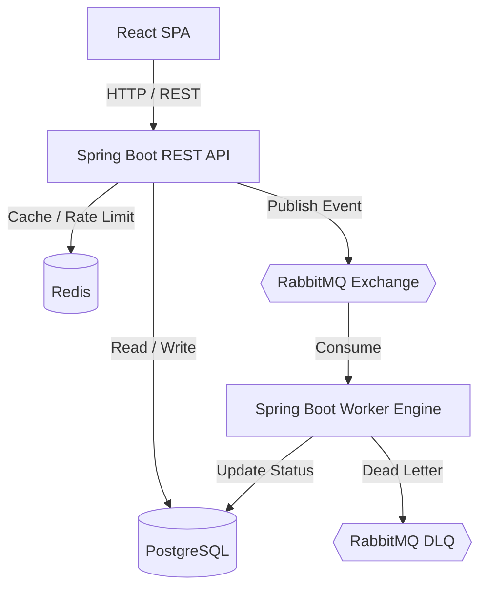

# 🚀 EventDriven NotifyEngine

### Plataforma Distribuída de Processamento Assíncrono e Notificações em Larga Escala

O **EventDriven NotifyEngine** é uma plataforma distribuída desenvolvida para processar **notificações, relatórios e agendamentos em larga escala** de forma assíncrona, resiliente e escalável.

O projeto resolve um problema comum em arquiteturas enterprise: **desacoplar o recebimento de requisições de alto tráfego do processamento pesado em segundo plano**, evitando que operações demoradas bloqueiem a API.

A solução utiliza uma arquitetura baseada em **microserviços, mensageria, processamento assíncrono, retry, DLQ, idempotência, observabilidade e autoscaling**.

---

## 📌 Objetivos

* Processar grandes volumes de tarefas de forma assíncrona.
* Desacoplar a API do processamento pesado.
* Garantir idempotência e evitar processamento duplicado.
* Implementar mecanismos de Retry e Dead Letter Queue.
* Controlar taxa de requisições com Redis.
* Monitorar métricas da aplicação e da infraestrutura.
* Permitir escalabilidade horizontal dos Workers.
* Demonstrar práticas de arquitetura utilizadas em sistemas enterprise.

---

# 🏗️ Arquitetura

O sistema é dividido em dois microserviços principais:

```text
                    ┌──────────────────────┐
                    │   React + TypeScript │
                    │      Frontend        │
                    └──────────┬───────────┘
                               │
                          HTTP / REST
                               │
                               ▼
                    ┌──────────────────────┐
                    │      notify-api      │
                    │ Spring Boot 3 / Java │
                    │         21           │
                    └──────┬───────┬───────┘
                           │       │
                 ┌─────────┘       └──────────┐
                 ▼                            ▼
          ┌─────────────┐              ┌─────────────┐
          │ PostgreSQL  │              │    Redis    │
          │ Transacional│              │ Cache / RL  │
          └─────────────┘              └─────────────┘
                           │
                     Publicação
                           │
                           ▼
                 ┌─────────────────┐
                 │ RabbitMQ / Kafka│
                 │  Message Broker │
                 └────────┬────────┘
                          │
                       Consume
                          │
                          ▼
                 ┌──────────────────────┐
                 │    notify-worker     │
                 │ Spring Boot 3 / Java │
                 │         21           │
                 └───────┬──────────────┘
                         │
                  ┌──────┴──────┐
                  ▼             ▼
           ┌────────────┐   ┌────────────┐
           │ PostgreSQL │   │    DLQ     │
           │  Status    │   │   Errors   │
           └────────────┘   └────────────┘
```

## 🔄 Fluxo de processamento

1. O cliente envia uma solicitação para o `notify-api`.
2. A API autentica a requisição utilizando JWT.
3. O evento é persistido no PostgreSQL com status `PENDING`.
4. A API publica o evento no Message Broker.
5. O `notify-worker` consome a mensagem.
6. O Worker verifica a idempotência do evento.
7. O processamento é executado.
8. Em caso de sucesso, o status é atualizado para `PROCESSED`.
9. Em caso de falha, o evento passa pelo mecanismo de Retry.
10. Após exceder o limite de tentativas, a mensagem é enviada para a DLQ.
11. O frontend pode consultar o status do processamento.

---

# 🧩 Microserviços

## `notify-api`

Microserviço responsável pelo recebimento e gerenciamento das solicitações.

Principais responsabilidades:

* Autenticação com JWT.
* API REST.
* Validação das requisições.
* Persistência de eventos.
* Publicação de mensagens.
* Rate Limiting.
* Consulta de status.
* Documentação OpenAPI/Swagger.

### Exemplo de fluxo

```text
POST /api/notifications
        │
        ▼
 Validação + JWT
        │
        ▼
 PostgreSQL
 status = PENDING
        │
        ▼
 RabbitMQ Exchange
```

---

## `notify-worker`

Microserviço responsável pelo processamento assíncrono.

Principais responsabilidades:

* Consumo de mensagens.
* Idempotência.
* Processamento de tarefas.
* Retry com backoff.
* Circuit Breaker.
* Atualização do status.
* Tratamento de falhas.
* Encaminhamento para DLQ.

```text
RabbitMQ
   │
   ▼
Worker
   │
   ├── Sucesso ──► PROCESSED
   │
   ├── Falha ────► RETRY
   │                  │
   │                  └──► DLQ
   │
   └── Duplicado ──► Ignorado
```

---

# 🧠 Arquitetura C4 — Container



---

# 🛠️ Stack Tecnológica

| Camada            | Tecnologia                  |
| ----------------- | --------------------------- |
| Backend           | Java 21                     |
| Framework         | Spring Boot 3               |
| Segurança         | Spring Security + JWT       |
| Persistência      | Spring Data JPA / Hibernate |
| Banco             | PostgreSQL                  |
| Cache             | Redis                       |
| Mensageria        | RabbitMQ                    |
| Frontend          | React + TypeScript          |
| UI                | Tailwind CSS                |
| Estado assíncrono | TanStack Query              |
| Resiliência       | Resilience4j                |
| Observabilidade   | Spring Actuator             |
| Métricas          | Prometheus                  |
| Dashboards        | Grafana                     |
| Containers        | Docker                      |
| Orquestração      | Kubernetes                  |
| Autoscaling       | Kubernetes HPA              |
| CI/CD             | GitHub Actions              |
| Testes            | JUnit + Testcontainers      |
| API Docs          | Springdoc OpenAPI           |

> O projeto utiliza RabbitMQ como broker principal. Kafka pode ser utilizado como alternativa para cenários que demandem maior throughput e retenção de eventos.

---

# 🛡️ Resiliência

O projeto implementa mecanismos para lidar com falhas e grandes volumes de processamento.

## Idempotência

Cada evento possui um identificador único.

O Worker verifica se o evento já foi processado antes de executar a operação, evitando:

```text
Evento A
   │
   ├── Processado ✓
   │
   └── Recebido novamente
             │
             ▼
        Ignorado ✓
```

A estratégia pode utilizar **Redis** para deduplicação ou o padrão **Transactional Outbox** para garantir maior consistência entre banco e mensageria.

---

## 🔁 Retry

Falhas temporárias não devem resultar imediatamente em uma mensagem perdida.

Exemplo:

```text
Tentativa 1
    │
    ▼
   Falha
    │
    ▼
Backoff
    │
    ▼
Tentativa 2
    │
    ▼
   Falha
    │
    ▼
Backoff
    │
    ▼
Tentativa 3
    │
    ▼
   Falha
    │
    ▼
   DLQ
```

O mecanismo utiliza **backoff exponencial** para evitar sobrecarga de serviços externos.

---

# ☠️ Dead Letter Queue

Mensagens que não conseguem ser processadas após o número máximo de tentativas são encaminhadas para uma **Dead Letter Queue**.

Isso permite:

* Inspeção manual.
* Diagnóstico de erros.
* Reprocessamento posterior.
* Evitar perda de mensagens.
* Separar mensagens problemáticas do fluxo principal.

---

# ⚡ Circuit Breaker

O **Resilience4j** é utilizado para proteger o Worker contra falhas em serviços externos.

```text
Worker
   │
   ▼
API Externa
   │
   ├── OK ─────────► Continua
   │
   └── Falhas
          │
          ▼
    Circuit Breaker
          │
          ▼
       OPEN
          │
          ▼
 Evita novas chamadas
```

---

# 📊 Observabilidade

A aplicação utiliza **Spring Boot Actuator**, **Prometheus** e **Grafana** para monitoramento.

Entre as métricas acompanhadas:

* Requisições HTTP.
* Tempo de resposta.
* Erros.
* Uso de CPU.
* Uso de memória.
* JVM.
* Quantidade de mensagens processadas.
* Mensagens com falha.
* Retries.
* Tamanho da fila.
* Taxa de processamento.

---

# ☸️ Kubernetes

Os manifestos Kubernetes ficam organizados em:

```text
k8s/
├── postgres-deployment.yaml
├── rabbitmq-deployment.yaml
├── api-deployment.yaml
├── worker-deployment.yaml
├── hpa.yaml
├── configmap.yaml
├── secret.yaml
├── services.yaml
└── ingress.yaml
```

## Health Checks

O `notify-api` possui:

```text
Liveness Probe
      │
      ▼
/actuator/health

Readiness Probe
      │
      ▼
/actuator/health
```

Isso permite ao Kubernetes identificar instâncias indisponíveis e remover temporariamente Pods que não estejam prontos para receber tráfego.

---

# 📈 Horizontal Pod Autoscaler

O Worker pode ser escalado automaticamente conforme a utilização dos recursos.

```yaml
apiVersion: autoscaling/v2
kind: HorizontalPodAutoscaler
metadata:
  name: notify-worker-hpa
spec:
  scaleTargetRef:
    apiVersion: apps/v1
    kind: Deployment
    name: notify-worker
  minReplicas: 2
  maxReplicas: 10
  metrics:
    - type: Resource
      resource:
        name: cpu
        target:
          type: Utilization
          averageUtilization: 70
```

Exemplo:

```text
Carga baixa
   │
   ▼
2 Workers

Carga aumentando
   │
   ▼
4 Workers

Carga alta
   │
   ▼
8 Workers

Carga máxima
   │
   ▼
10 Workers
```

---

# 🐳 Execução Local

## Pré-requisitos

Instale:

* Java 21
* Maven
* Docker
* Docker Compose
* Node.js
* Kubernetes (opcional)
* Minikube ou Kind (opcional)

---

## 1. Clonar o projeto

```bash
git clone <URL_DO_REPOSITORIO>
cd eventdriven-notifyengine
```

---

## 2. Subir a infraestrutura

```bash
docker-compose up -d
```

Serviços esperados:

```text
PostgreSQL
Redis
RabbitMQ
Prometheus
Grafana
```

---

## 3. Executar a API

```bash
cd notify-api
mvn spring-boot:run
```

---

## 4. Executar o Worker

Em outro terminal:

```bash
cd notify-worker
mvn spring-boot:run
```

---

## 5. Executar o Frontend

```bash
cd frontend
npm install
npm run dev
```

---

# ☸️ Executando com Kubernetes

Com um cluster Kubernetes disponível:

```bash
kubectl apply -f k8s/
```

Verificar os Pods:

```bash
kubectl get pods
```

Verificar os Services:

```bash
kubectl get services
```

Verificar o HPA:

```bash
kubectl get hpa
```

---

# 📚 Documentação da API

A API utiliza **Springdoc OpenAPI**.

Após iniciar o `notify-api`, a documentação estará disponível em:

```text
/swagger-ui.html
```

Também será disponibilizada uma coleção para testes:

```text
docs/
└── postman_collection.json
```

A coleção contém exemplos de:

* Autenticação.
* Criação de notificações.
* Consulta de status.
* Listagem de tarefas.
* Simulação de falhas.

---

# 🧪 Testes

O projeto utiliza:

* JUnit
* Spring Boot Test
* Testcontainers
* Testes de integração
* Testes de mensageria

Executar:

```bash
mvn test
```

---

# 💥 Teste de Retry e DLQ

Para testar o mecanismo de resiliência:

1. Envie uma nova tarefa pela API.
2. Configure o Worker para simular uma falha.
3. Observe o consumo da mensagem.
4. Aguarde as tentativas de Retry.
5. Após atingir o limite configurado, a mensagem será encaminhada para a DLQ.
6. Verifique a mensagem no RabbitMQ.
7. Corrija a causa da falha.
8. Reprocesse a mensagem.

Fluxo esperado:

```text
API
 │
 ▼
RabbitMQ
 │
 ▼
Worker
 │
 ├── Falha
 │
 ▼
Retry Queue
 │
 ├── Falha
 │
 ▼
Retry Queue
 │
 ├── Falha
 │
 ▼
DLQ
```

---

# 🔄 CI/CD

O projeto utiliza **GitHub Actions** para automatizar:

* Build.
* Testes unitários.
* Testes de integração.
* Build das imagens Docker.
* Push das imagens.
* Validação dos manifestos Kubernetes.

Pipeline:

```text
Git Push
   │
   ▼
GitHub Actions
   │
   ├── Checkout
   │
   ├── Setup JDK 21
   │
   ├── Maven Test
   │
   ├── Docker Build
   │
   ├── Docker Push
   │
   └── Kubernetes Validation
```

Arquivo:

```text
.github/
└── workflows/
    └── ci-cd.yml
```

---

# 📁 Estrutura do Projeto

```text
eventdriven-notifyengine/
│
├── notify-api/
│   ├── src/
│   ├── pom.xml
│   └── Dockerfile
│
├── notify-worker/
│   ├── src/
│   ├── pom.xml
│   └── Dockerfile
│
├── frontend/
│   ├── src/
│   ├── package.json
│   └── Dockerfile
│
├── k8s/
│   ├── postgres-deployment.yaml
│   ├── rabbitmq-deployment.yaml
│   ├── api-deployment.yaml
│   ├── worker-deployment.yaml
│   ├── hpa.yaml
│   ├── configmap.yaml
│   ├── secret.yaml
│   ├── services.yaml
│   └── ingress.yaml
│
├── docs/
│   └── postman_collection.json
│
├── docker-compose.yml
├── .github/
│   └── workflows/
│       └── ci-cd.yml
│
└── README.md
```

---

# 🎯 Diferenciais Técnicos

O projeto foi estruturado para demonstrar conhecimentos de desenvolvimento backend e arquitetura distribuída, incluindo:

* Microserviços.
* Arquitetura orientada a eventos.
* Processamento assíncrono.
* Java 21.
* Spring Boot 3.
* Spring Security.
* JWT.
* RabbitMQ.
* PostgreSQL.
* Redis.
* Idempotência.
* Transactional Outbox.
* Retry com backoff.
* Dead Letter Queue.
* Circuit Breaker.
* Resilience4j.
* Docker.
* Kubernetes.
* HPA.
* Prometheus.
* Grafana.
* Testcontainers.
* GitHub Actions.
* CI/CD.
* OpenAPI.
* React + TypeScript.

---

# 🧠 Objetivo Arquitetural

O principal objetivo do **EventDriven NotifyEngine** é demonstrar como construir uma aplicação capaz de lidar com **alto volume de requisições sem acoplar o tempo de resposta da API ao tempo de processamento das tarefas**.

A arquitetura permite:

```text
                 ALTO TRÁFEGO
                      │
                      ▼
               ┌─────────────┐
               │   notify-api │
               └──────┬──────┘
                      │
               Mensagem Assíncrona
                      │
                      ▼
               ┌─────────────┐
               │   RabbitMQ   │
               └──────┬──────┘
                      │
              ┌───────┴────────┐
              ▼       ▼        ▼
           Worker   Worker   Worker
              │       │        │
              └───────┴────────┘
                      │
                      ▼
                 PostgreSQL
```

Dessa forma, a aplicação pode **absorver picos de tráfego**, distribuir o processamento entre múltiplos Workers e escalar horizontalmente conforme a demanda.

---

## 📌 Status

🚧 **Em desenvolvimento**

O projeto está sendo construído de forma incremental, priorizando inicialmente o fluxo principal de mensageria e processamento assíncrono, seguido pelas camadas de resiliência, observabilidade, Kubernetes e CI/CD.

---

## 👨‍💻 Projeto

**EventDriven NotifyEngine**

**Java 21 • Spring Boot 3 • RabbitMQ • PostgreSQL • Redis • React • TypeScript • Docker • Kubernetes**
